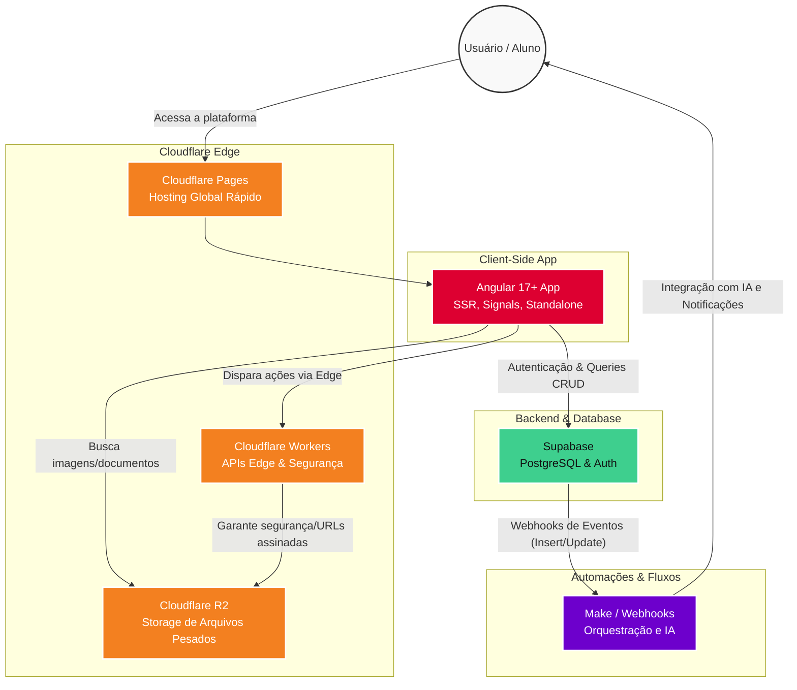

# 🏗️ Arquitetura do SIMA (Sistema Inteligente de Monitoramento Acadêmico)

Este documento descreve a arquitetura técnica, as escolhas de infraestrutura e o fluxo de dados do **SIMA**, um projeto de extensão acadêmica focado em estruturação de processos e documentação inteligente.

O objetivo desta arquitetura é garantir **alta performance, escalabilidade, segurança e baixo custo operacional**, servindo como um case de Engenharia de Produção aplicada ao Desenvolvimento de Software.

---

## 🗺️ Diagrama de Arquitetura

O diagrama abaixo ilustra como as diferentes partes do sistema interagem:

---

## 🛠️ Stack Tecnológico e Justificativas

A escolha das tecnologias foi feita com base nos princípios de **eficiência de processo** (facilidade de manutenção e deploy) e **eficiência de custo** (aproveitamento de *free tiers* generosos e arquiteturas serverless).

### 1. Frontend: Angular & Tailwind CSS
* **Angular (v17+):** Escolhido por sua robustez e arquitetura opinativa. O uso de **Signals** garante uma reatividade de alta performance, e os **Standalone Components** reduzem a complexidade e o tamanho do bundle. O **SSR (Server-Side Rendering)** é utilizado para otimizar o tempo de carregamento inicial e melhorar o SEO acadêmico.
* **Tailwind CSS:** Utilizado para estilização rápida e consistente, permitindo a criação de interfaces modernas diretamente no template HTML sem a necessidade de gerenciar arquivos CSS extensos.

### 2. Backend & Banco de Dados: Supabase
* **Supabase (PostgreSQL):** Funciona como a espinha dorsal dos dados do sistema. Foi escolhido por oferecer um banco de dados relacional sólido (Postgres) com uma camada de API gerada automaticamente (PostgREST), além de gerenciar a autenticação de usuários (Auth) e permissões de segurança diretamente no banco de dados via RLS (Row Level Security).

### 3. Infraestrutura & Cloud: Cloudflare
* **Cloudflare Pages:** Hospeda a aplicação Angular, garantindo distribuição global via CDN, tempos de resposta ultrarrápidos e deploys contínuos integrados ao GitHub.
* **Cloudflare R2:** Escolhido estrategicamente para o armazenamento de arquivos (como PDFs e imagens de disciplinas). Diferente do AWS S3, o R2 possui **zero taxas de egress** (cobrança por transferência de dados de saída), o que é fundamental para manter os custos do projeto acadêmico baixos mesmo com alto volume de acessos.
* **Cloudflare Workers:** Utilizado para rodar lógicas seguras na "borda" (edge), como a geração de URLs assinadas para proteger arquivos sensíveis armazenados no R2, garantindo que apenas usuários autenticados tenham acesso.

### 4. Automação e Processos: Make (Integração & IA)
* **Make:** Em vez de poluir o código do frontend com SDKs de inteligência artificial ou regras de negócio complexas de notificação, utilizamos o Make para orquestração de processos.
* **Funcionamento:** O Supabase dispara Webhooks para o Make quando eventos ocorrem no banco de dados (ex: novo material inserido). O Make então processa essa informação, conecta-se a APIs de IA para sumarização ou categorização, e automatiza processos como disparo de e-mails ou atualizações no banco, mantendo o frontend leve.

---

## 🔐 Segurança

* **Row Level Security (RLS):** Todas as tabelas no Supabase possuem políticas estritas. Alunos só podem ver dados permitidos e apenas administradores podem inserir/modificar conteúdos.
* **Tokens e Edge:** Proteção de rotas sensíveis feita pelo Angular Guards no client-side, e URLs de arquivos protegidas por Workers no Edge. Variáveis de ambiente sensíveis nunca são expostas ao repositório público.
